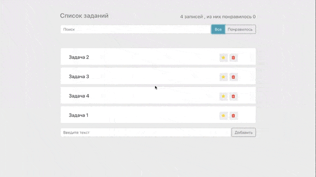

Стэк технологий: JavaScript , Framework: React .
# Первый проект по курсу "Полный курс по Javascript + React"
## Автор курса: Иван Петриченко

### Описание изученного материала:
1. Основные фичи ES6-8 стандартов.
2. Модульные структуры использование в  React.
3. Препроцессор JSX.
4. Свойства и состояния компонентов. События в React.
5. Подключение стилей и знакомство с styled-components.
6. Собственные события и иммутабильность.
7. Работа с формами в React.

**В этом репозитории первый проект второй части курса.**

[Ссылка на первую часть курса](https://github.com/winesf/JavaScript)

#### Проект "Упаравление задачами" 

Функционал приложения:
* Добавление/Удаление задач.
* Добавление в Избранное/Понравившиеся. 
* Поиск по задачам.

